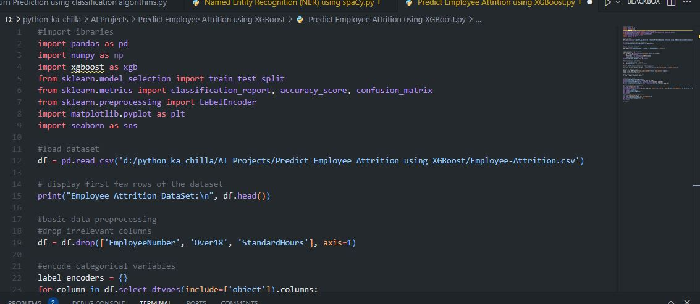
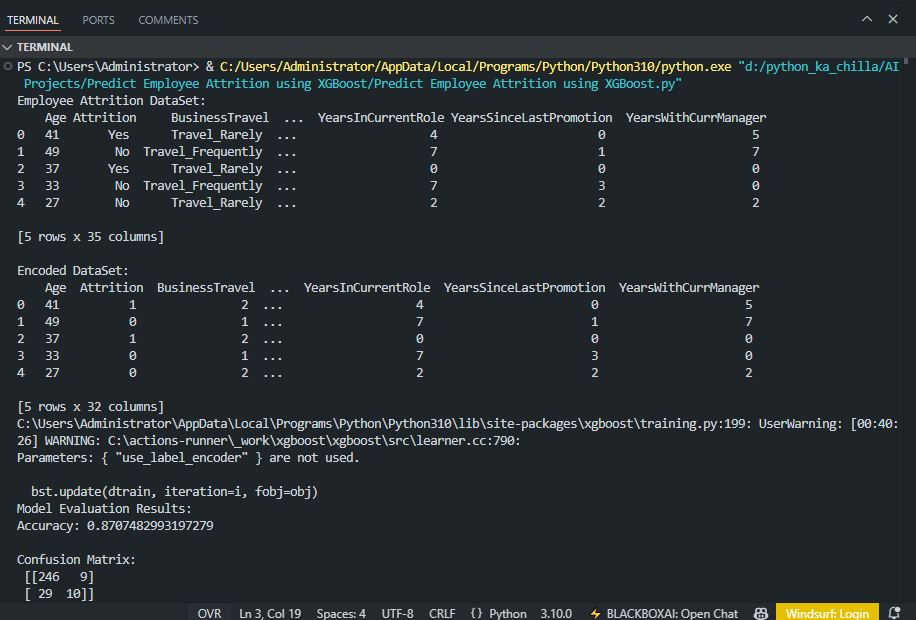
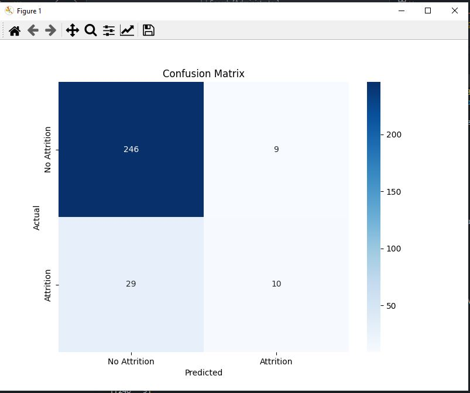

# 👥 Employee Attrition Prediction using XGBoost 🤖  
       

<p align="center">
  
</p>

🚀 This project builds an **XGBoost classifier** to predict employee attrition (whether an employee leaves the company) based on HR dataset features. It includes data preprocessing (label encoding of categorical variables), model training, and evaluation with accuracy, confusion matrix, and classification report. Feature importance visualization helps identify key factors influencing attrition.

---

## ✨ Key Features  
📊 **HR Dataset** – Realistic employee data with features like age, job role, satisfaction, etc.  
🧠 **XGBoost Classifier** – Powerful gradient boosting algorithm for classification  
🔧 **Data Preprocessing** – Label encoding for categorical columns, dropping irrelevant fields  
📈 **Model Evaluation** – Accuracy, confusion matrix, and detailed classification report  
📉 **Visualization** – Confusion matrix heatmap and feature importance plot  
🔍 **Interpretability** – Identifies top features driving attrition (e.g., DailyRate, MonthlyIncome)  

---

## 🧠 Tech Stack  
- **Language:** Python 🐍  
- **Libraries:** pandas, numpy, scikit‑learn, xgboost, matplotlib, seaborn  
- **Model:** XGBoost Classifier  
- **Evaluation:** Accuracy, Confusion Matrix, Classification Report  

---

## 📦 Installation  

```bash
git clone https://github.com/SayabArshad/Employee-Attrition-Prediction-XGBoost.git
cd Employee-Attrition-Prediction-XGBoost
pip install pandas numpy scikit-learn xgboost matplotlib seaborn
```

⚙️ Note: The dataset Employee-Attrition.csv is included in the repository (sample from IBM HR Analytics). Ensure it is in the project folder.

---

## ▶️ Usage

Run the main script:

```bash
python "Predict Employee Attrition using XGBoost.py"
```

The script will:

Load and preprocess the dataset.

Encode categorical variables.

Split data into training (80%) and testing (20%) sets.

Train an XGBoost classifier.

Print accuracy, confusion matrix, and classification report.

Display a confusion matrix heatmap and a feature importance plot.

---

## 📁 Project Structure

```
Employee-Attrition-Prediction-XGBoost/
│-- Predict Employee Attrition using XGBoost.py   
│-- Employee-Attrition.csv                         
│-- README.md                                        
│-- assets/                                          
│    ├── code.JPG
│    ├── output.JPG
│    ├── plot.JPG
│    └── plot 2.JPG
```
---

## 🖼️ Interface Previews

| 📝 Code Snippet | 📊 Console Output |
|:---------------:|:-----------------:|
|  |  |

| 📉 Confusion Matrix | 📈 Feature Importance |
|:-------------------:|:---------------------:|
|  |  |
---

## 💡 About the Project

Employee attrition is a critical concern for organizations, impacting productivity and increasing recruitment costs. This project leverages the XGBoost algorithm to predict which employees are likely to leave. Using the IBM HR Analytics dataset, the model analyzes features such as age, daily rate, job satisfaction, and years at the company. After preprocessing (label encoding, dropping irrelevant columns), the XGBoost classifier achieves ~87% accuracy. The confusion matrix and feature importance plots provide insights into model performance and the key drivers of attrition – a valuable tool for HR departments to take proactive retention measures.

---

## 🧑‍💻 Author

**Developed by:** [Sayab Arshad Soduzai](https://github.com/SayabArshad) 👨‍💻

📅 **Version:** 1.0.0

📜 **License:** MIT License


---

## ⭐ Contributions

Contributions are welcome! Fork the repository, open issues, or submit pull requests to enhance functionality (e.g., hyperparameter tuning, adding more models, or building a web interface).
If you find this project helpful, please ⭐ star the repository to show your support.

---

## 📧 Contact

For queries, collaborations, or feedback, reach out at **[sayabarshad789@gmail.com](mailto:sayabarshad789@gmail.com)**

---

👥 Predicting employee turnover to build better workplaces.

---
